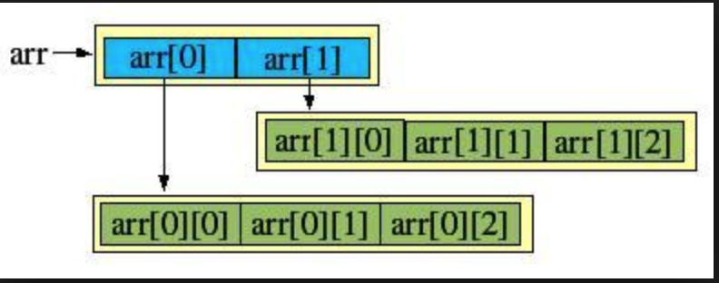

# 二维数组的本质
二维数组的内存模型，例如int data[3][3]


### 2.二维数组的数组名实际上是一个数组类型的指针，表示的是这个一维数组的地址，而不是这个一维数组的首地址（结合数组指针理解）

```
#include <stdio.h>
#include <string.h>
#include <stdlib.h>

void main()
{
    int i = 0, j = 0, tmp = 0;
    //&a的步长  5*4 = 20；
    int a[5] = {3,4,5,6,2};
    //myarray也是数组首元素的地址
    //myarray是一个常量指针
    //myarray是一个数组指针
    int myarray[3][5]; //不管是几维数组，在内存中都是连续的线性存储的（这也就是为什么至少要写为"a[][5]"）
    //直接定义一个数组指针
    int (*p)[5] = &a;
    for(i=0; i<5; i++)
    {
        printf("%d\n",(*p)[i]);//或者写为*((*p)+1)
    }
    for(i=0; i<3; i++)
    {
        for(j=0;j<5;j++)
        {
            myarray[i][j] = tmp++;
        }
    }
	//可以看出myarray表示的是这个二维数组中的第一个一维数组（参考上图）的地址（注意是整个数组的地址，不是数组首元素的地址），*myarray表示的是数组首元素的地址。
	//这样就可以像数组指针那样去访问元素的值
    printf("======%d\n",*((*myarray)+1)); //1
    printf("%d,%d\n",myarray,myarray+1);//相差20
    printf("\n%d,%d\n",&a,&a+1);   //相差20
}
```

**结论：不管是几维数组，在内存中都是连续的线性存储的（这也就是为什么至少要写为"a[][5]"） **

### 3.二维数组做函数参数
```
#define _CRT_SECURE_NO_DEPRECATE
#include"stdio.h"
#include"stdlib.h"
#include"string.h"
void printf1(int (*a)[5])//二维数组在做函数参数时，退化为指针（数组类型的指针）
{
    int i = 0;
    for(i=0; i<5; i++)
    {
        printf("%d\n",(*a)[i]);
    }
}
void main()
{
    int i = 0, j = 0,tmp = 0;
    int a[3][5];
    for(i=0; i<3; i++)
    {
        for(j=0;j<5;j++)
        {
            a[i][j] = tmp++;
                  //给第i行第j 列赋值
                //*(*（a+i）+j) = tmp++    //a是一个数组类型的指针，“+i”表示移动到第几行，“*（a+i）”表示取第几行的地                    址，“+j”表示移动的第几个，最后再*p赋值
        }
    }
    printf1(a);
}
```

### 4挖字符串放到一个二维数组中
```
#include <stdio.h>
#include <string.h>
#include <stdlib.h>

int spitString1(char *str, char c, int *count, char (*s)[30])
{
    int count1 = 0;
    char *ptmp = str;
    int temcount = 0;
    char *p = str;
    do{
        p = strchr(p ,c);
        if(p != NULL)
        {
            temcount = p - ptmp;
            memcpy(s+count1, ptmp, temcount);
             //s+count1表示的是第几个一维数组的地址(不是这个一维数组首元素的地址)，取*表示的是首元素的地址，加temcount表示最后一个元素，再取*表示这个元素的值
            *(*(s+count1)+temcount)= '\0';
            // s[count1][temcount] = '\0';
            count1++;
            ptmp = p = p + 1;
        }
        else
        {
            break;
        }
    }while(*p != '\0');
    *count = count1;
}
void main()
{
    int i = 0;
    char *p = "acdsd,fdafs,gsa,";
    char c  = ',';
    int count = 0;
    char s[10][30] = {0};
    spitString1(p, c , &count, s);
    for(i=0; i<3; i++)
    {
        printf("%s\n",s[i]);
    }
    printf("改变的行数%d\n",count);
}  
```
